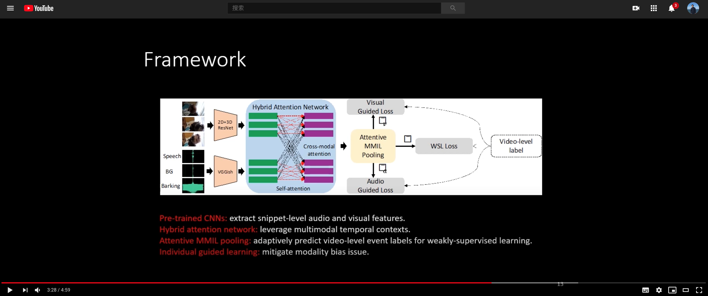
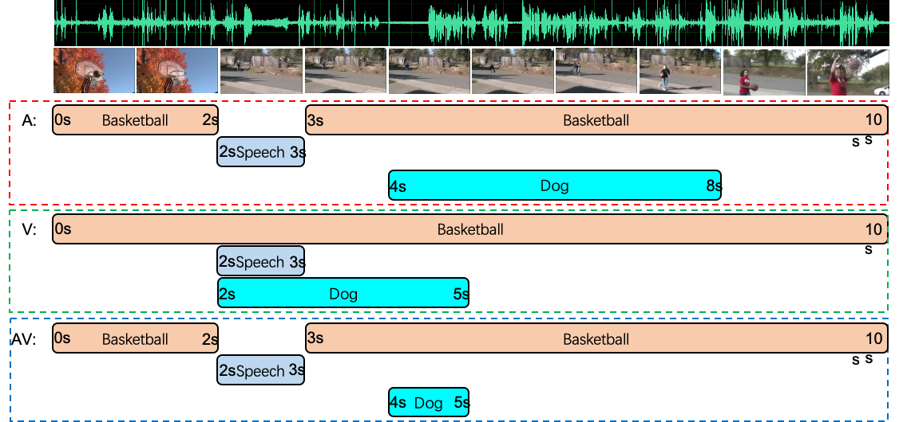

Unified Multisensory Perception: Weakly-Supervised Audio-Visual Video Parsing (To appear in ECCV 2020) 

[Paper](https://www.ecva.net/papers/eccv_2020/papers_ECCV/papers/123480443.pdf) [Video](https://www.youtube.com/watch?v=y4QB5RicUo8) 

[](https://www.youtube.com/watch?v=y4QB5RicUo8)

### Audio-visual video parsing

We define the Audio-Visual Video Parsing as a task to group video segments
and parse a video into different temporal audio, visual, and audio-visual events
associated with semantic labels.



### LLP Dataset & Features

under preparation.

### Requirements

```bash
pip install -r requirements
```

### Weakly supervised audio-visual video parsing 

Testing: 


```bash
python main_avvp.py --mode train --gpu 0 --audio_dir /xx/feats/vggish/ --video_dir /xx/feats/res152/ --st_dir /xx/feats/r2plus1d_18/
```

Training:

```bash
python main_avvp.py --mode test --gpu 0 --audio_dir /xx/feats/vggish/ --video_dir /xx/feats/res152/ --st_dir /xx/feats/r2plus1d_18/
```
### Download videos (coming soon)

download raw videos

### Feature extraction (coming soon)

extract you own audio and visual features

### Citation

If you find this work useful, please consider citing it.

<pre><code>@InProceedings{tian2018ave,
  author={Yapeng Tian, Dingzeyu Li, and Chenliang Xu},
  title={Unified Multisensory Perception: Weakly-Supervised Audio-Visual Video Parsing},
  booktitle = {ECCV},
  year = {2020}
}
</code></pre>


