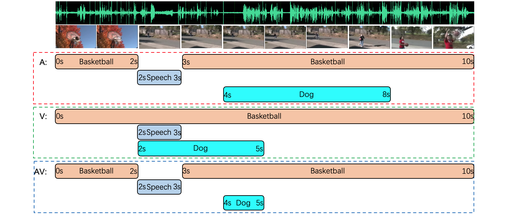

Unified Multisensory Perception: Weakly-Supervised Audio-Visual Video Parsing (To appear in ECCV 2020) [[Paper]](https://arxiv.org/pdf/2007.10558.pdf)

[Yapeng Tian](http://yapengtian.org/), [Dingzeyu Li](https://dingzeyu.li/), and [Chenliang Xu](https://www.cs.rochester.edu/~cxu22/) 

### Audio-visual video parsing

We define the <b>Audio-Visual Video Parsing</b> as a task to group video segments
and parse a video into different temporal audio, visual, and audio-visual events
associated with semantic labels.




### LLP Dataset & Features
```bash
# LLP dataset annotations
cd data
AVVP_dataset_full.csv: full dataset with weak annotaions
AVVP_train.csv: training set with weak annotaions
AVVP_val_pd.csv: val set with weak annotaions
AVVP_test_pd.csv: test set with weak annotaions
AVVP_eval_audio.csv: audio event dense annotations for videos in val and test sets
AVVP_eval_visual.csv: visual event dense annotations for videos in val and test sets
```
Note that audio-visual events can be derived from audio and visual events.

We use [VGGish](https://github.com/tensorflow/models/tree/master/research/audioset/vggish), [ResNet152](https://pytorch.org/docs/stable/torchvision/models.html), and [ResNet (2+1)D](https://pytorch.org/docs/stable/torchvision/models.html) to extract audio, 2D frame-level, and 3D snippet-level features, respectively. 
The audio and visual features of videos in the LLP dataset can be download from this Google Drive [link](https://drive.google.com/file/d/10CeaI1G9uIyz5dKnd7XTeH9-qOehC7CL/view). The features are in the "feats" folder.


### Requirements

```bash
pip install -r requirements
```

### Weakly supervised audio-visual video parsing 

Testing: 


```bash
python main_avvp.py --mode test --audio_dir /xx/feats/vggish/ --video_dir /xx/feats/res152/ --st_dir /xx/feats/r2plus1d_18/
```

Training:

```bash
python main_avvp.py --mode train --audio_dir /xx/feats/vggish/ --video_dir /xx/feats/res152/ --st_dir /xx/feats/r2plus1d_18/
```
### Download videos (optional)

Download raw videos in the LLP dataset. The downloaded videos will be in the data/LLP_dataset/video folder. Pandas and FFmpeg libraries are required.
```bash
python ./scripts/download_dataset.py 
```

### Data pre-processing & Feature extraction (optional)
Extract audio waveforms from videos. The extracted audios will be in the data/LLP_dataset/audio folder.  moviepy library is used to read videos and extract audios.   
```bash
python ./scripts/extract_audio.py
```
Extract video frames from videos. The extracted frames will be in the data/LLP_dataset/frame folder. 
```bash
python ./scripts/extract_frames.py 
```

Audio feature extractor can be found from [here](https://drive.google.com/file/d/1TJL3cIpZsPHGVAdMgyr43u_vlsxcghKY/view).

2D visual feature. pretrainedmodels library is required.
```bash
python ./scripts/extract_rgb_feat.py
```
3D visual feature. 
```bash
python ./scripts/extract_3D_feat.py
```


### Citation

If you find this work useful, please consider citing it.

<pre><code>@InProceedings{tian2020avvp,
  author={Tian, Yapeng and Li, Dingzeyu and Xu, Chenliang},
  title={Unified Multisensory Perception: Weakly-Supervised Audio-Visual Video Parsing},
  booktitle = {ECCV},
  year = {2020}
}
</code></pre>

### License
This project is released under the [GNU General Public License v3.0](https://github.com/Mukosame/Zooming-Slow-Mo-CVPR-2020/blob/master/LICENSE).


